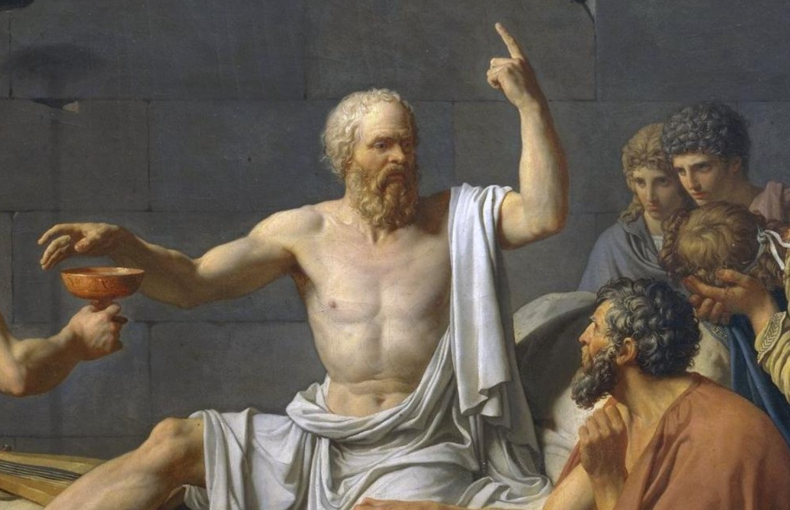

```
Epistemic - “relating to knowledge or to the degree of its validation”  
```
Damn, that's a fancy phrase. 
I take no credit for it, I am over my fancy word phase. I heard it first in a Shane Parish podcast from his guest Tyler Cowen.  

The idea is not new at all and is quite important and often forgotten or misunderstood. Here is what the cool dude of antiquity, Socrates, had to say about human knowledge -

 ```"The only true wisdom is in knowing that you know nothing."```




In simple words, I  would say it is personal and intellectual humility.
Whether we are aware of it or not, we all have a world view. We all have a set of beliefs about how the world works.  Sometimes we have thought about these beliefs, examined them and sometimes we have just assimiliated them through societal norms.  Our world view ranges from incomplete to downright wrong in most cases. And that is why we need the intellectual modesty to acknowledge the limits of our knowledge, examine our belief system regularly and change it if it is wrong.  

Socrates again popped into my head and said

 ```"An unexamined life is not worth living"```

Here I am going to define some of the ideas, mental models that I find worth learning, practising and internalising.


## Avoid ruin situations
```A lot of success in business and in life comes from knowing what you want to avoid - Charlie Munger```

This is really about what kind of risks to take. There are additive risks (+/-) or multiplicative risks( multiply by 0). You probably want to take a lot of additive risks where the odds are slightly in your favor. You defintely want to avoid all multiplicative risk. 
Example of additive risk would be putting your money in Apple stock. Example of multiplicative risk could be reputation risk, health risk - obeseity, STDs,COVID (may be) and addictive drugs. Reputation is bigger currency than money, it is built slowly and is lost in a second. If you have to ask, is this legal? Don't do it. 

```Not crossing the line is not enough, we need to work in a way that we should never have to ask where the line is.```

Avoid people you do not respect or have questionable ethics. A billion multiplied by zero is still zero.


## Keep losses in the right perspective

Losses loom larger than wins in human psyche. That is we are more motivated to avoid losses than to achieve gains. Trying to avoid losses can make us do outright stupid things. Like averaging an asset when the decission of buying it in the first place was either stupid or wrong. Understanding sunk costs is important here.
Expending a good asset(money, time, emotions) after a bad asset is a recipe of disaster. 

 ```Losses are inevitable``` so we try to win the WAR not every battle.

It is however important to ```Know the difference between bad decisions and bad outcomes```
A good decission can have a bad outcome. A bad decission can sometimes have a good outcome if we are lucky. We should consciously evaluate our decissions and if a good decission lead to a bad outcome, that is life.

## Avoiding hedonistic treadmills
With internet, gaming, social media, content streaming services we are running on hedonistic treadmills which give us regular shots of dopamine and serotonin.  Content is crafted very cleverly to keep us engaged in perpetuity. Content these days is like a well made candy with the right mix of salt and sugar that never really satiates you.
High dependence on social media, steaming services is a way to avoid questions that our inner voice keeps asking. You can live your entire life avoiding it but I wager that won't be a very satisfying life. It is ok to not have answers. It is ok to not live upto every ideal. Get comfortable with discomfort, learn to enjoy free time, your own company, your relationships. 


## Act Now
If there is a problem in life (of health, relationship, business, career or investing) the time to act is now.
- You realized that you are neglecting your health - act now. 
- You realized that you are neglecting your relationships, apologize and make up for it - now.
- You made an asset purchase that was a mistake, own it up and book loss - now.
- A personal habit is dragging you down, quit it. Go cold turkey - now.


## Use Consistency Principle to your advantage

```“A man uses his  behavior to tell him about himself. It is one of the primary source of beliefs, values and attitudes” - Robert Cialdini(paraphrased) ``` 

We form a self image consistent with our actions. If you want to change the way you think about yourself, start associating with a new identity even when you are not actually there. 
You will initially feel like a fraud but your mind will actually start building a new self image which is consistent with your new actions and before you know your behavior will change and the adopted identity becomes the new normal. This is the consistency principle of self image.

Consistency principle works on the dark side too, associate with stupid things and bad behavior and your self image will deteriorate and you will start to believe that you are actually worthless.

## Rules work better than self discipline

I struggle with self discipline. Based on reading and experience, what works for me is having very few rules and never break them. Example of such a rule could be I work out every day or I don't eat dessert. A rule is a decission already made, no will power needed to be mustered. Rules harden and become habits very soon and then you are in auto pilot. 
Another bright side of having rules is nobody argues with rules, you don't even argue with your own rules once they are set. If you have a rule that you you don't drink beer no one will request you to do otherwise.

## Compounding
Remember the power of compounding and use it for your good. Compounding, as all great forces have a dark side too. It will work against you if you are on the wrong side of it. All negative things compound too and often their rate of compounding is significantly higher than anything positive. Beware of negative compounding effects on your health, relationships, debt and reputation. 

### Compound for learning
Read more and diverse. Write if you want to compound your learning and sharpen your ideas. If you want to take it a notch higher teach it to somebody.

### Compound your money/ assets
Think enough has been said about this.

### Compounding for Health
Exercise, meditation and routine benefits only show up with consistency. I struggle with this alot. I have a plan to get a lot better.

### Compounding for relationships
If you deposit consistently in your relationships by being there, they will compound. If you don’t they will wither away, sometimes slowly and often completely.


## Regression to the mean
Things regress to the mean, they always do. High performance and poor performance both regress to the mean. So taper your expectations from companies, from your children and the world at large when they are doing good and be optimistic when they are doing bad. And most importantly forecast the future keeping effects of regression in mind.

## Use algorithms in your life
Humans can be emotional, unpredictable, irrational, loss averse and greedy. No human is a rational agent. We do not even follow the laws we have made for ourselves. We are affected by our moods, herd mentality and social norms. We are terrible in predicting outcomes, we have many documented and undocumented biases.

We can use algorithms to aid us in making important decisions. This not only means using computer code to help us, but also following a sequence of predefined steps to arrive at a decision. 

Example, while interviewing a new hire, score him at different predetermined parameters (Technical competence, Communication, Empathy, Culture fit etc). These parameters could have pre determined weight in calculating the final score. Assign weights individually and calculate overall score. If the overall score is higher than a preset cutoff hire the applicant. 


## Social Proof and its effects
```When all think alike, no one thinks very much.```
    - Walter Lippman

Social proof is valuable. We want to do know what our brethren is doing. Life has been so much better now that we have product reviews for almost everything we buy. We need to examine the behavior of groups and be on guard against herd mentality. There is a serious flaw in the argument that says if so many people are doing it, it must be right. In matters of great importance, examine the social proof and then make your own decision.
